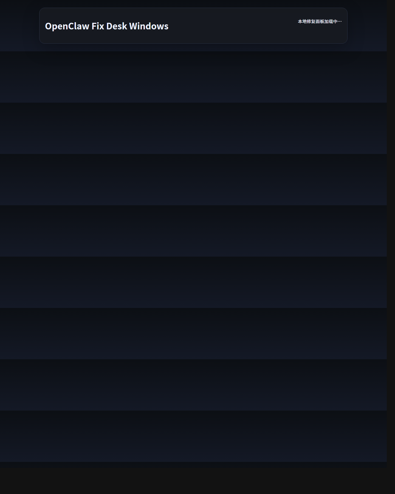

# OpenClaw Fix Desk Windows

[](https://github.com/Parkersback/OpenClaw-Fix-Desk-Windows/releases)
[](./LICENSE)
[](https://github.com/Parkersback/OpenClaw-Fix-Desk-Windows)
[](https://github.com/openclaw/openclaw)

A local repair dashboard for **OpenClaw on Windows**.

一个面向 **Windows 平台 OpenClaw 用户** 的本地修复面板。

---

## Quick Links | 快速入口

- **GitHub Release / 下载发布版**  
  https://github.com/Parkersback/OpenClaw-Fix-Desk-Windows/releases
- **Latest portable package / 最新便携包**  
  `OpenClaw-Fix-Desk-Windows-Portable.zip`
- **Single-file launcher EXE / 单文件启动 EXE**  
  `OpenClaw-Fix-Desk-Windows-Portable-Launcher.exe`
- **Default local panel / 默认本地面板地址**  
  `http://127.0.0.1:41891`

## Screenshot | 截图



---

## Why this project exists | 为什么做这个项目

OpenClaw power users often know that most problems are fixable, but the repair path is scattered across commands, logs, and memory.

很多 OpenClaw 用户都知道，大多数问题其实都能修，但修复路径常常散落在命令、日志和经验里。

This project turns those scattered repair steps into a small Windows-friendly utility.

这个项目把这些分散的修复步骤整理成一个更适合 Windows 的小工具。

---

## What it does | 它能做什么

**OpenClaw Fix Desk Windows** helps users quickly diagnose and repair common OpenClaw issues, especially:

**OpenClaw Fix Desk Windows** 主要帮助用户快速诊断和处理 OpenClaw 常见问题，尤其是：

- Gateway not running or unhealthy  
  Gateway 无法正常运行或状态异常
- OpenAI / Codex login expired or needs relogin  
  OpenAI / Codex 登录失效或需要重新登录
- Common local repair flows such as `doctor --repair` + restart  
  常见本地修复流程，例如 `doctor --repair` + 重启
- Quick access to logs and recommended next actions  
  快速查看日志和下一步建议

---

## Main Features | 主要功能

### Diagnosis | 诊断

- OpenClaw Gateway status diagnosis  
  OpenClaw Gateway 状态诊断
- OpenAI / Codex OAuth issue detection  
  OpenAI / Codex OAuth 登录问题检测
- Basic network reachability checks  
  基础网络连通性检测
- Common log error signal display  
  常见日志报错信号展示
- Suggested next actions after diagnosis  
  诊断后的推荐下一步动作

### Repair actions | 修复动作

- **Restart Gateway**  
  **重启 Gateway**
- **Auto Repair** (`openclaw doctor --repair --yes --non-interactive` + restart)  
  **自动修复**（`openclaw doctor --repair --yes --non-interactive` + restart）
- **Relogin OpenAI / Codex**  
  **重新登录 OpenAI / Codex**
- **Relink Feishu** (optional)  
  **重新链接 Feishu**（可选）
- **Open logs terminal**  
  **打开日志终端**

---

## Best Use Cases | 最适合的使用场景

This tool is most useful when:

这个工具最适合：

- OpenClaw is already installed  
  OpenClaw 已安装
- a user hits a Codex login problem  
  用户遇到 Codex 登录问题
- Gateway seems broken or unhealthy  
  Gateway 看起来异常或不可用
- a user wants a faster repair workflow than manually hunting commands  
  用户想要一个比手动找命令更快的修复流程

---

## Requirements | 运行前提

Before using this tool, the machine should already have:

在使用这个工具之前，目标机器最好已经具备：

- **Windows**
- **Node.js installed**
- **OpenClaw installed**
- `openclaw` available in PowerShell / CMD PATH
- Optional: configured OpenClaw channels / auth profiles  
  可选：已经配置好的 OpenClaw 渠道 / 认证资料

If those prerequisites are missing, this tool may still open, but some repair actions will fail.

如果这些前提没有满足，这个工具可能仍然能打开，但部分修复动作会失败。

---

## Quick Start | 快速开始

### Standard start | 标准启动

Double-click:

双击：

- `start.cmd`

Then open:

然后打开：

- `http://127.0.0.1:41891`

### Hidden start | 静默启动

Double-click:

双击：

- `launch-hidden.vbs`

### Stop | 停止

Double-click:

双击：

- `stop.cmd`

---

## Portable Package | 便携版

A portable release zip can be generated with:

可以通过下面的脚本打包便携版：

- `package-portable.ps1`

Generated output:

生成产物：

- `release/OpenClaw-Fix-Desk-Windows-Portable.zip`
- `release/OpenClaw-Fix-Desk-Windows-Portable-Launcher.exe`

This is useful for:

它适合：

- backing up the project  
  备份项目
- moving the tool to another Windows machine  
  移动到另一台 Windows 电脑
- sharing with another OpenClaw user  
  分享给其他 OpenClaw 用户
- giving someone a simpler single-file launcher entry  
  给别人一个更简单的单文件启动入口

---

## Project Structure | 项目结构

```text
OpenClaw-Fix-Desk-Windows/
├─ public/                  # Frontend assets | 前端资源
├─ src/                     # Local server logic | 本地服务逻辑
├─ start.cmd                # Start the app | 启动程序
├─ stop.cmd                 # Stop the app | 停止程序
├─ launch-hidden.vbs        # Hidden launch helper | 静默启动辅助
├─ package-portable.ps1     # Build portable package | 打包便携版
├─ PORTABLE-README.txt      # Portable notes | 便携版说明
└─ README.md                # This file | 本说明
```

---

## Known Limitations | 已知限制

- It is still a **v0 prototype**.  
  它目前仍然是一个 **v0 原型**。
- It assumes a Windows machine that already uses OpenClaw.  
  它默认目标机器已经在使用 OpenClaw。
- Some diagnosis rules are heuristic, not perfect.  
  一些诊断规则是启发式判断，不是绝对精确。
- Interactive auth must still happen in a real terminal.  
  交互式认证仍然必须在真实终端里完成。
- It is not yet a polished native desktop app.  
  它还不是一个打磨完整的原生桌面应用。

---

## Roadmap Ideas | 后续方向

Possible future improvements:

后续可以继续增强：

- better error classification  
  更细的错误分类
- better preflight checks for missing Node / OpenClaw  
  更好的 Node / OpenClaw 缺失前置检查
- stronger UI states for common failures  
  更明显的常见故障 UI 状态
- native desktop packaging (Electron / Tauri)  
  原生桌面封装（Electron / Tauri）
- diagnosis history / repair history  
  诊断历史 / 修复历史
- more provider / channel repair entries  
  更多 provider / channel 修复入口

---

## License | 许可证

MIT License.

采用 MIT License。
